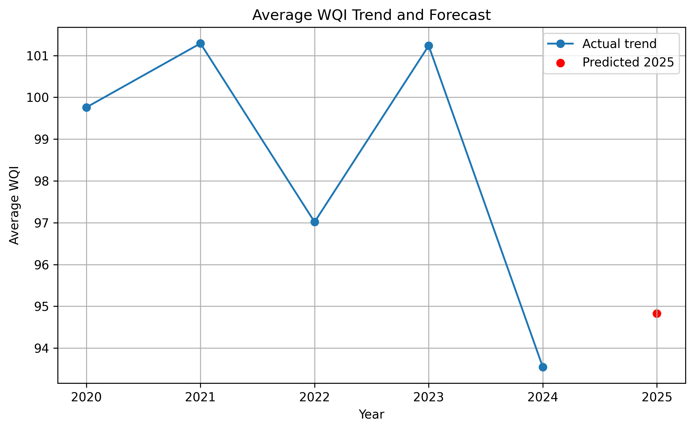

# Water Pollution Analysis in Kazakhstan

This project is a bachelor’s thesis prototype focused on analyzing and visualizing water pollution levels in Kazakhstan using open environmental data.

## Current Progress

At the current stage, the project includes:

- collection and preprocessing of water pollution data
- processed dataset with 500+ records
- calculation and validation of analytical indicators:
  - concentration
  - maximum permissible concentration (MPC)
  - Water Quality Index (WQI)
  - hazard classification
- baseline machine learning model for WQI trend forecasting
- initial analytical visualizations

## Analytical Module

The current analytical module includes:

- Ratio calculation
  ratio = concentration / MPC

- Hazard classification
  - ratio < 1 → Safe
  - 1 ≤ ratio < 2 → Moderate
  - ratio ≥ 2 → High Risk

- WQI-based analysis
  - average WQI by region
  - WQI trend over time

- Baseline prediction
  - Linear Regression model for WQI forecasting

## Dataset Fields

- The processed dataset contains the following columns:

 - ID
 - Date
 - Basin
 - Region
 - Pollutant
 - Concentration
 - MPC
 - WQI_Score
 - Hazard_Class


```bash
data/            # processed datasets
analytics/       # analytical and ML scripts
outputs/         # generated visualizations

